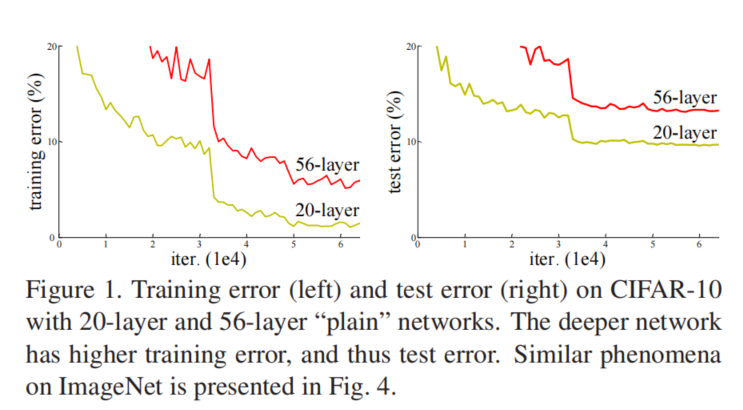
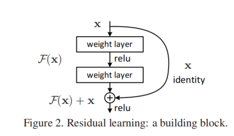
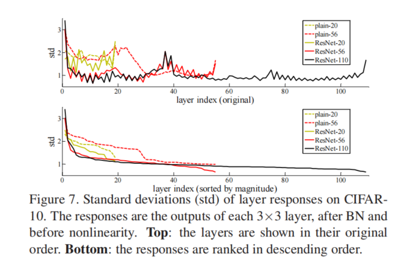

# Deep Residual Learning for Image Recognition

> paper link: https://openaccess.thecvf.com/content_cvpr_2016/papers/He_Deep_Residual_Learning_CVPR_2016_paper.pdf

- [研究摘要](#研究摘要)

- [研究问题](#研究问题)

- [相关工作缺陷](#相关工作缺陷)
   - [残差](#残差)
    - [短路连接](#短路连接)

- [解决办法](#解决办法)

- [其他相关文献](#其他相关文献) 

- [疑问点](#疑问)

  ## 研究摘要

  在深度神经网络的训练中，网络深度的增加会使得训练结果的误差增大，本文通过提出一种利用残差训练的方式来提高训练的精度，使得模型的优化更加容易，准确。同时复杂度也没有提高很多。

  

  ## 研究问题

  深度卷积网络为图像分类领域带来了一系列突破，而同时最近的证据表明神经网络的的层数深度十分重要，越深的网络层数可以处理更复杂的模型。但是在网络层数的加深过程中，出现了一个退化问题，Vanishing/exploding gradients 在从一开始就阻止了收敛。而同时，更深的层会导致更高的训练误差。图一显示了这个问题，更高的层数得到了更大的训练误差。

  

  

  ​             																	             图一

  所以，在本文中提出了一个深度残差学习框架来解决该问题，`F(x)=H(x)-x`,在原来任务引入`H(x)`进入下一层的基础上改进为引入`H(x)`进入下一个weight layer后用激活函数激活后再进入下一weight layer，同时与本体`x`相加。 （need to improve later）

  


  这样做有两个好处：

  - 残差与本体相比数据量与复杂度降低了很多，对于神经网络来说很容易优化。而将本体简单的丢入训练网络中会得到很高的训练误差。
  - 这个残差深度网可以很容易的在网络深度的增加中获得精度，产生的结果会大大优于以前的网络。

  这个网络在许多比赛中都获得了很好的训练效果，表明了方法的有效性。

  同时在多个数据集上也显示了类似的现象，表明该方法不仅仅是类似一个特定的数据集。

  

  ## 相关工作缺陷


  ### 残差
  VALD将残差编码表示到字典中。但是应用的比较浅，仅仅用于图像检索和分类。但是也表明残差向量在编码方面比原始向量有更好的性能。
  在对像素层面(low-level)的图像工程和计算机图像学来说，常要解决偏微分方程问题，而这个问题的子问题就是要对粗粒度和细粒度的残差分别求解。实验表明，用残差方法可以收敛的更快，但是并没有发现对残差在深度学习方便的优势。

  ### 短路连接

  短路连接最初为了解决梯度消失与梯度爆炸问题，但是在后续的研究中发现该方法无效。
  “highway networks”提出了一个类似门的结构，在有的时候会阻止数据与参数的传递。但是在我们的工作中不同的是，我们是parameter-free。而且high-way shortcut在很深的网络中并没有发现性能提升，我们有。

## 解决办法

  假设`H(x)`是最低层映射，从输入到输出的映射，有可能是被网络的一个模块学习到的也可能是被整个网络学习到的。x为输入。根据万能网络定理，我们将这个映射调整为拟合`H(x)-x`，`F(x)=H(x)-x`为残差。在学习完残差后加入输入x就与最初的拟合目标`H(x)`一致了。拟合残差简单，因为神经网络拟合恒等映射能力较差（退化现象）。



该图表明了残差模块更好。

重构后的残差模块为

```
y=F(x,{W})+x
```

后面部分就是各个数据集中的实验，有空再补

## 其他相关文献

待续

## 疑问

待续

  
