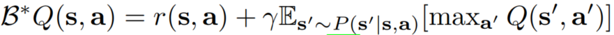
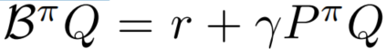
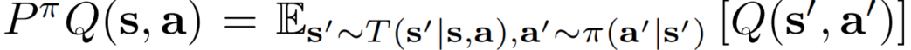
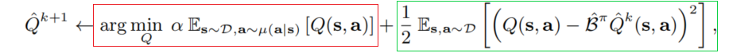
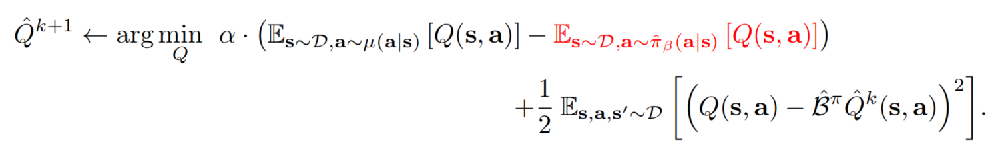
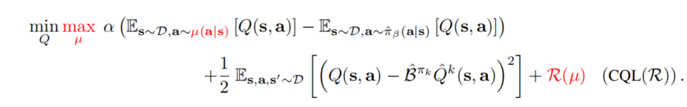

# Conservative Q-Learning for Offlfline Reinforcement Learning

> paper link:https://arxiv.org/pdf/2006.04779.pdf

- [研究摘要](#研究摘要)

- [介绍](#介绍)

- [准备知识](#准备知识)
  
- [CQL框架](#CQL框架)

- [offline RL 的CQL 框架](#offline RL 的CQL 框架)

   

   ## 研究摘要

   在强化学习的研究中，如何有效的利用大尺度的数据集一直是一个很大的挑战。而offline RL（离线强化学习）能够从先前收集的数据集中学习有效的策略，同时还不需要与环境进行更多的交互，有着十分广阔的应用前景。但是传统的offline RL算法在处理一些特别复杂或者存在多模态的数据集中常常会失败，这是由于从数据集中学习到的策略与数据集常常会存在偏差，一般来说是对Q值的过估计（Overestimation）。所以在本文中，提出了一种算法CQL，使得学习到的策略值要比真实的策略值低（lower bound）（Fig.1），解决了过估计的问题。CQL算法比其他的offline RL算法的效率提高了2-5倍。

   

   

   ​																	Fig. 1 通常的训练结果和理想的训练结果对比

   

   ## 介绍

   offline RL 能解决 online RL中与环境交互下花费高同时又危险的问题，而且online RL可收集到的数据数量要比offline RL少很多。但是offline RL存在的主要问题就是从数据集中学习到的策略与数据集收集的策略存在很大的偏移（训练的结果与理想不同），产生了分布外操作（out-of-distribution）和过拟合（overfitting）。而在策略拟合和策略提升过程中，通常只用到了策略的值Q。所以我们就可以学习一个不那么保守的Q值策略来让这个策略低于下界，然后在通过加入一个数据分布上的最大化项来收紧这个界限。

   

   ## 准备知识

   在马尔科夫决策过程中，我们都希望能够奖励最大化。如果我们定义数据集为 $D$, $\pi_\beta (a|s)$  定义为行为策略（所有策略的合集）。数据集D是从 $d^{\pi\beta}$ $\pi_\beta (a|s)$ 中采集到的。而与此对应的是 $\hat{\pi} _\beta (a|s)$ 是从数据集 $D$ 中学习到的学习到的经验行为策略。因为数据集不可能包含所有的 $(s,a)$ 映射。所以从数据集中训练得到的 $|r(s|a)| \leq R_{max} $ 。

   通常，在Q-learning 方法中，我们通过对贝尔曼最优算子（Func 1）的迭代来得到一个能使Q值最大的策略，然后在通过贪心算法（将这个策略带回去找action,在找能使该action发生概率最大的策略）来不断优化这个策略

   

   ​                                                  Func 1. 贝尔曼最优算子，reward加上系数 $y$  乘 能使接下来的动作Q值最大的 S-R映射的期望。

   

   通常，在 Actor-critic 方法中，有一个单独的策略来训练使 Q值最大。再通过贝尔曼算子对策略进行提升。提升的方式就是通过不断地更新action来最大化期望的Q值。

   

   

   因为我们是在数据集 $D$ 中进行训练，而 $D$ 不可能包含所有的 $ (s,a,s^{'})$ 映射，所有我们得到的策略是一种基于数据集的经验策略 $ \hat{\pi}^k$。但是在策略改进的过程中，因为为了获得最大的Q值，就有可能错误的指向到可以获得高Q值得分布外行为。

   

   ## CQL 框架

   所以为了阻止策略值的过估计，本文通过Q值最小化并加上了一个标准的贝尔曼误差 来设计了一个十分保守的低下界的Q-function。所以我们选择是在特定的state-action分布 $\mu(s,a)$ 下最小化期望的Q值。因为在Q-function训练不会检索未观测到的states,但是会检索未见到的action。 所以我们把 $\mu$ 限制在数据集的边缘状态。   $\mu(s,a)=$  $d^{\pi\beta}$ $\mu (a|s)$  

   

   红框为最小化的Q值函数。绿框为标准贝尔曼误差。 因为我们最小化了Q值函数，所以可以保证在边界内。

   而我们希望能够更逼近边界而不仅仅是在边界内。所我们加了一个在行为策略下的额外的Q值最大化项来希望逼近边界。

   

   因为等式二最大化了行为策略下的Q值。所以得到的Q值可能并不是在边界内，但是通过后续附录证明可以得到基于此产生的策略是低于下界的。

   总结来说，CQL框架通过等式一来学习一个在真实Q值下界内的Q-function,通过等式二获得了一个能够获得期望Q值的更逼近下界的策略。

   ## offline RL 的CQL 框架

   根据上两式，可以通过使 $\mu=\pi$ 来解出能使Q值逼近下界Q的策略 $\pi$， 我们不再通过用一步策略评估获得策略，然后再用一步策略提升改进策略。取而代之的是。 我们用我们从Fun 2中获得策略 $\pi$ 来获得最大的 Q值。 也可以加一个正则项变成CQL（R)

   
