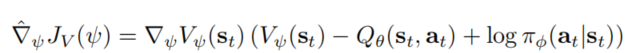

[TOC]

# Soft Actor-Critic: Off-Policy Maximum Entropy Deep Reinforcement Learning with a Stochastic Actor

> paper link: https://arxiv.org/pdf/1801.01290.pdf

- [研究摘要](#研究摘要)

- [介绍](#介绍)

- [准备知识](#准备知识)
  
- [CQL框架](#CQL框架)

- [offline RL 的CQL 框架](#offline RL 的CQL 框架)

  

   ## 研究摘要

   model-free(无模型)的强化学习帮助解决了许多控制任务和挑战决策。但是在两个方面存在这很大的挑战：处理高复杂度模型和模型收敛时的脆弱性。所以在本篇文章中，作者提出了一个基于最大熵的强化学习框架。这个框架的目的是最大化奖励的同时能够最大化熵，这样的话就可以尽可能的让任务执行过程中进行随机探索。和其他off-policy的算法相比，我们这个算法更加稳定。

   

   ## 介绍

   虽然model-free(无模型)的强化学习帮助解决了许多控制任务和挑战决策。但还是在两个方面存在着问题。第一个是在处理复杂模型时候的高花费。另一个是这些方法很容易受到超参数的影响。这两个问题限制了model-free RL在真实世界任务中的可应用性。所以在本篇文章中，作者提出了一个基于最大熵的强化学习框架。这个框架的目的是最大化奖励的同时能够最大化熵，这样的话就可以尽可能的让任务执行过程中进行随机探索。和其他off-policy的算法相比，我们这个算法更加稳定。在先前的工作中，虽然也提出了在on-policy上的最大墒model-free RL框架。但是在on-policy中， 受限于低样本复杂度，表现较差。而off-policy中，需要在连续的动作空间中进行复杂的近似推理过程。

   基于以上不足，我们提出了一个off-policy的最大墒AC算法。 我们叫SAC， SAC避免了先前基于soft Q-learning中最大熵算法中的近似推断的复杂性和潜在不确定性。

   

   ## 准备知识

   在马尔科夫决策过程中，我们都希望能够奖励最大化。如果我们定义数据集为 $D$, $p_\pi(s_t)$和$p_\pi(s_t|a_t)$是由 $\pi (a_t|s_t)$  而产生的状态和状态动作边缘分布。

   

   ## 最大熵强化学习

   标准的RL通常为了得到一个最大化的奖励 $\sum E_{(s_t ,a_t)~p_\pi}[r(s_t,a_t)]$ ,而在SAC中，为了扩展到最大熵项，奖励项被写成

   

   $\alpha$ 项为温度系数，用来控制熵项相对于奖励的重要性，从而控制最优策略的随机性。该算法的优势在于被激励去更广泛的探索，同时还会放弃明显没有希望的途径。同时，这个策略可以捕获接近最优策略的行为。我们观察到，就算与传统RL下效果最好的算法相比，SAC也大大提高了学习的速度。据我们所知，我们的方法是最大熵强化学习框架中的第一个off-policy Actor-Critic方法。

   ## 从Soft policy iteration 到SAC
   
   原本Q-value的函数是这样的。
   
   
   
   我们将定义一个参数化的状态值函数 $V_{\psi}s_t$，软q函数 $Q_{\theta}(s_t,a_t)$ 和一个，和一个易于处理的策略 $\pi_{\phi}(a_t|s_t)$ 这些网络的参数分别为 $\psi,\theta,\phi$ 。
   
   状态值函数被用于训练减小平方残差，其中D为replay_buffer
   
   
   
   而上式的梯度可以被下面的无偏移估计式子所表示。
   
   
   
   这个时候action是从当前学习到的政策中来提取。
   
   而Q-value是用来训练使得soft bellman residual残差最小
   
   
   
   通过对网络不断地加深迭代。我们得到了SAC算法。
   
   
   
   
